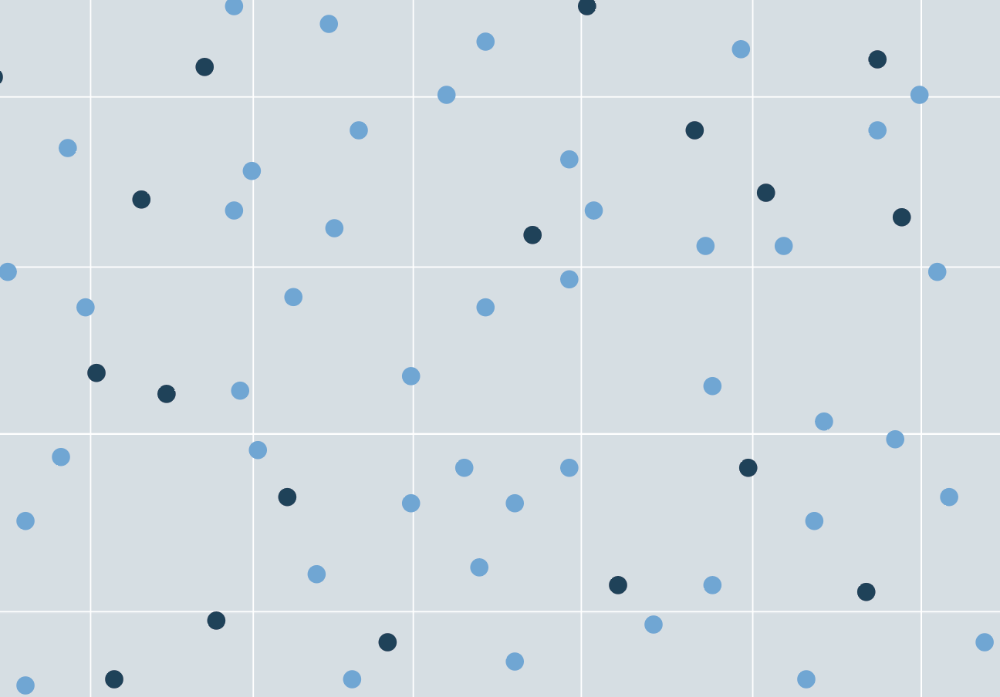

+++
title = 'Determinantal Point Processes'
draft = true

[math]
enable = true
+++

| 

 | 

 | 

 |
| :-----------: | :-----------: | :-----------: |
| **Author:** Joanna Zou | **Date:** Dec. 2024 | [Cite this page]() |

While determinantal point processes (DPPs) are useful probabilistic models for drawing diverse subsets from a discrete set, subsets drawn from a DPP can vary in both size and content. In many applications, subsets of a \textit{fixed size} are required -- for instance, in producing search results for an image search engine [1], predicting a number of outcomes from forecast models [5], or curating training sets for machine learning [2, 6]. k-DPPs are a class of determinantal point processes which are useful for such applications, representing probability measures over subsets with fixed cardinality $k > 0$ with greater expressivity compared to elementary DPPs.

This paper proceeds as follows. Section 1 reviews the standard formulation of DPPs. Section 2 introduces k-DPPs, the fixed-sized formulation of DPPs. Section 3 outlines the sampling algorithm for k-DPPs and discusses computational considerations. Section 4 illustrates k-DPPs on a numerical example. 

## Determinantal point processes

Consider a set of $N$ discrete elements with indices $\mathcal{Y} = \{1,...,N\}$.  A determinantal point process (DPP) is a probability measure placed over all $2^N$ subsets of $\mathcal{Y}$, where probabilities are determined by the kernel matrix $K \in \mathbb{R}^{N \times N}$ associated with the process. In practice, the kernel matrix is constructed from evaluations of a positive semidefinite kernel function $\kappa: \mathcal{Y} \times \mathcal{Y} \to \mathbb{R} $ between each pair of elements in the set, where $K_{ij} = \kappa(Y_i, Y_j)$ for $Y_i, Y_j \in \mathcal{Y}$. If the kernel matrix satisfies conditions for the existence of the $L$ formulation (namely, that $P(\emptyset) \neq 0$ and $K$ has no eigenvalue equal to 1 [2]), then the $L$ ensemble  corresponding to $K$ is given by: 

\begin{equation}
    L = K (I - K)^{-1}
\end{equation}

The DPP is then defined equivalently by the following, for random subsets $\textcolor{blue}{Y} \subseteq \mathcal{Y}$ and a fixed subset $A \subseteq \mathcal{Y}$: 

**PDF definition.** The probability density function of the DPP is given by: 

\begin{equation}
    \mathcal{P}(\textcolor{blue}{Y} = A) & = \frac{\det(L_A)}{\sum_{A' \subseteq \mathcal{Y}} \det(L_{A'})}
\end{equation}

where $L_A = [ L_{ij} ]_{i,j \in A}$ denotes the matrix restricted to entries indexed by the elements of A. The PDF definition is also referred to as the ``L formulation'' of the DPP [4]. 

**CCDF definition.** The complementary cumulative density function of the DPP is given by: 

\begin{equation}
    \mathcal{P}(\textcolor{blue}{Y} \supseteq A) & = \det(K_{A})}
\end{equation}

In other words, the probability that $A$ is a subset of the randomly drawn set $\textcolor{blue}{Y}$ is given by the determinant of the kernel matrix restricted to entries indexed by $A$. A special case of the CCDF is the marginal probability of each element of the set, which is given by the diagonal of the $K$ matrix: 

\begin{equation}
    \mathcal{P}(i \in \textcolor{blue}{Y}) = K_{ii}
\end{equation}

The marginal probability is also referred to in literature as the ``inclusion probability'' [2]. The CCDF definition is also referred to as the ``K formulation'' of the DPP [4]. 

**CDF definition.** The cumulative density function of the DPP is given by: 

\begin{equation}
    \mathcal{P}(\textcolor{blue}{Y} \subseteq A) & = \det(I - K)_{\bar{A}}
\end{equation}

where $\bar{A}$ denotes the complement, $\bar{A} = \mathcal{Y} \setminus A$. 

## Mixture of elementary DPPs

An important property of a DPP is that it can be represented as the mixture of elementary DPPs. Also referred to as \textit{projection DPPs}, an elementary DPP has a kernel matrix which is a projection matrix of rank $r \leq N$, e.g. $K^\textup{T} K = K$ and $K = VV^\textup{T}$ for a set of $r$ orthonormal vectors $V$ [4]. Elementary DPPs then have the property that: 

\begin{equation}
  \mathcal{P}^{V_r}(A) =
    \begin{cases}
      \det(K_A) & \text{if $|A| = r$}\\
      0 & \text{otherwise}
    \end{cases}       
\end{equation}

Therefore, only $\binom{N}{r}$ subsets of size exactly $r$ have non-zero probability [4]. The PDF of the DPP can be represented as the mixture of elementary DPPs, using the eigendecomposition of the $L$ matrix $L = \sum_{i=1}^N \lambda_i \mathbf{v}_i \mathbf{v}_i^{\textup{T}}$:

\begin{equation}
    \mathcal{P}(\textcolor{blue}{Y} = A) = \frac{1}{\det(I+L)} \sum_{J \subseteq 1:N} \mathcal{P}^{V_J} \prod_{i \in J} \lambda_i
\end{equation}

In particular, it can be shown that the normalizing constant of the density can be derived as [1]: 

\begin{equation}
    \sum_{A' \subseteq \mathcal{Y}} \det(L_{A'}) & = \det(I + L) = \prod_{i=1}^N (\lambda_i + 1)
\end{equation}

The mixture representation of DPPs lends it to a computationally tractable sampling algorithm. In particular, the DPP can be sampled by drawing samples from each of the elementary DPPs with probability $\frac{\prod_{i \in J} \lambda_i}{\prod_{i=1}^N (\lambda_i + 1)}$.

## Fixed-size determinantal point processes (k-DPPs)

A k-DPP is a DPP which produces samples of fixed size $k \leq N$. Unlike elementary DPPs, which are restricted to represent specific probability measures associated with a projection kernel matrix, k-DPPs can represent a more flexible range of probability measures over the subsets. As one example, a k-DPP can be defined to assign a uniform distribution over subsets, whereas a singular elementary DPP cannot [2]. Therefore, elementary DPPs can be considered a subclass of k-DPPs. 

A k-DPP can be understood as a special form of conditional DPP, with the following PDF: 

\begin{equation}
    \mathcal{P}(\textcolor{blue}{Y} = A | \  |\textcolor{blue}{Y}| = k) & = \frac{\det(L_A)}{\sum_{|A'| = k} \det(L_{A'})}
\end{equation}

where the normalizing constant is a sum over all subsets $A' \in \mathcal{Y}$ with restricted cardinality $|A'| = k$. It can be shown that the k-DPP can also be expressed as a mixture of elementary DPPs: 

\begin{equation}
    \mathcal{P}(\textcolor{blue}{Y} = A | \  |\textcolor{blue}{Y}| = k) = \frac{1}{e^N_k} \sum_{|J| = k} \mathcal{P}^{V_J} \prod_{i \in J} \lambda_i
\end{equation}

The normalizing constant of this distribution differs from that of the standard DPP. It can be derived as follows:

\begin{equation}
    \begin{aligned}
        \sum_{|A'| = k} \det(L_{A'}) & = \det(I+L) \sum_{|A'| = k} \mathcal{P}(\textcolor{blue}{Y} = A') \\
        & = \sum_{|J| = k} \prod_{i \in J} \lambda_i
    \end{aligned}
\end{equation}

The derivation uses the property that sets drawn from the elementary DPP have cardinality $|J|=k$ with probability 1, such that the expression reduces to the sum of products of eigenvalues indexed by elements in each $J$ subset. One can recognize this term to be the $k$th elementary symmetric polynomial [2]: 

\begin{equation}
    e^N_k = e_k(\lambda_1, ..., \lambda_N) = \sum_{J \subseteq 1:N \atop |J| = k} \prod_{i \in J} \lambda_i
\end{equation}

The marginal probability of elements, now considering fixed sizes to the subsets drawn, is proportional to the eigenvalues of $L$ scaled by a ratio of the elementary symmetric polynomials: 

\begin{equation}
    \label{eq:marginalprob}
    \mathcal{P}(i \in \textcolor{blue}{Y} | \  |\textcolor{blue}{Y}| = k) = \lambda_N \frac{e^{N-1}_{k-1}}{e^N_k}
\end{equation}

## Sampling from k-DPPs

Algorithm \ref{alg:sampling} for sampling from k-DPPs is reproduced from [1,2]. We follow by discussing its distinctions from the sampling algorithm for regular DPPs and its computational bottlenecks. 

The algorithm is composed of two loops: Loop 1 samples eigenvectors of $L$ to form a subspace from which to draw the samples. While the eigenvectors are sampled with probability $\frac{\lambda_n}{\lambda_n+1}$ for standard DPPs, the probability becomes $\lambda_n \frac{e^{n-1}_{l-1}}{e^n_l}$ for k-DPPs. Moreover, sampling is performed until strictly $k$ eigenvectors are obtained. Loop 2 iteratively samples elements from the eigenvectors, orthonormalizing the basis after each sample is drawn. While the cardinality of the basis $V$ varies for standard DPPs, it is kept fixed at $k$ for k-DPPs. 

Computationally, the sampling of regular DPPs and k-DPPs differ primarily in the computation of the probabilities in Loop 1. For k-DPPs, this involves calculating the ratio of elementary symmetric polynomials, the cost of which scales exponentially. For instance, calculation of $e^N_k$ takes on the order of $\mathcal{O}(k \binom{N}{k})$ operations due to the combinatorial problem. To address this cost, the authors of [1,2] recommend implementing a recursive algorithm to construct all symmetric elementary polynomials at once, using the recurrence relation: 

\begin{equation}
    e^N_k = e^{N-1}_k + \lambda_N e^{N-1}_{k-1}
\end{equation}

The recursive algorithm has polynomial cost at $\mathcal{O}( N k )$, significantly reducing the computational overhead of the sampling algorithm. Nevertheless, evaluation and sampling of k-DPPs are in general more costly in comparison to regular DPPs because of the additional work involved in normalizing the probability density. 

\begin{algorithm}
\caption{Sampling from a k-DPP}\label{alg:sampling}
\begin{algorithmic}
\Require $0 < k \leq N$, eigendecomposition $\{(\mathbf{v}_n, \lambda_n)\}_{n=1}^N$ of $L$ 
\\
\State \textit{Loop 1: sample eigenvectors to form subspace}
\State $J \gets \emptyset$
\State $l \gets k$
\For{n = N, ..., 2, 1}
    \If{$l = 0$}
        \State \textbf{break}
    \EndIf
    \If{$u \sim U[0,1] < \lambda_n \frac{e^{n-1}_{l-1}}{e^n_l}$}
        \State $J \gets J \cup \{ n \}$
        \State $l \gets l - 1$
    \EndIf
\EndFor
\\
\State \textit{Loop 2: draw samples from orthonormalized subspace}
\State $V \gets \{\mathbf{v}_n \}_{n \in J}$
\State $Y \gets \emptyset$
\While{$|V| > 0$}
    \State Select $i$ from $\mathcal{Y}$ with $Pr(i) - \frac{1}{|V|} \sum_{\mathbf{v} \in V} (\mathbf{v}^\textup{T} \mathbf{e}_i)^2$
    \State $Y \gets Y \cup i$
    \State $V \gets V_\perp$ (orthonormal basis for subspace of $V$ orthogonal to $\mathbf{e}_i$)
\EndWhile
\\
\\
\textbf{Output:} $Y$
\end{algorithmic}
\end{algorithm}

\section{Numerical example}

We illustrate the diversity-promoting properties of k-DPPs in a simple numerical example. We consider a 2D Gaussian mixture model (GMM) with equally weighted, identical components and draw 10,000 samples from the distribution to produce a clustered dataset, shown in Figure \ref{fig:gmm}. The objective is to draw $k=4$ sized subsets from the total dataset to observe whether elements of the subset span across the domain to represent the four modes of the distribution, acting as quadrature-like points. 

\begin{figure}[h!]
    \centering{\includegraphics[width=0.8\textwidth]{figures/GMM.png}}
    \caption{10,000 samples from a 2D Gaussian mixture model.}
    \label{fig:gmm}
\end{figure}

Figure \ref{fig:dpp_samples} shows a few realizations of samples from the k-DPP, drawn using Algorithm \ref{alg:sampling} written from scratch in Julia. We observe that for all samples, at least one element falls in the range of 3 of the modes, and for other samples, there is exactly one element for each of the 4 modes. This visually indicates that we achieve good coverage of the components of the GMM using k-DPP subsampling. 

\begin{figure}[h!]
    \centering{\includegraphics[width=\textwidth]{figures/DPP_samples.png}}
    \caption{A few realizations of k-DPP samples with $k=4$.}
    \label{fig:dpp_samples}
\end{figure}

To quantify this coverage, we compare the k-DPP approach to subsampling to simple random sampling (SRS) of four elements of the dataset. In particular, we represent ``diversity'' by the mean Euclidean distance between the four points in the subset, and repeat sampling over 10,000 trials to generate an empiricial distribution over the diversity metric. In Figure \ref{fig:distances}, we see that the histogram of mean distances from SRS is generally lower (with an average around 3) with greater variance compared to the histogram from k-DPPs (with an average around 3.8). In particular, k-DPPs produce a distribution with significantly lower variance and a sharp peak around its average value, which is the mean distance associated with the DPP mode. 

\begin{figure}[h!]
    \centering{\includegraphics[width=0.8\textwidth]{figures/distribution_distances.png}}
    \caption{Mean distance between elements of subsets drawn by DPP vs. simple random sampling (SRS). }
    \label{fig:distances}
\end{figure}

The high probability associated with the DPP mode is apparent in Figure \ref{fig:inclusion_prob}, where we plot the 10,000 points in the total set colored according to their probability of inclusion in the k-DPP set, computed as the marginal probability in Equation \eqref{eq:marginalprob}. We see that only a handful of points are associated with high probability (greater than 0.75), whereas most of the other points have probability close to zero. The points with high probability are drawn the most number of times, as they constitute the DPP mode. We see that collectively, these points represent the four modes of the GMM distribution, indicating the k-DPP correctly identifies clusters in the dataset. This simple study validates that k-DPPs can be used as a diversity-based subsampling scheme.  

\begin{figure}[h!]
    \centering{\includegraphics[width=0.9\textwidth]{figures/inclusion_prob.png}}
    \caption{k-DPP inclusion probabilties of each element of the set. }
    \label{fig:inclusion_prob}
\end{figure}

\section*{References}

\medskip

\small

[1] A. Kulesza, B. Taskar (2011). “k-DPPs: Fixed-Sized Determinantal Point Processes”. \textit{ICML 2011}.

[2] A. Kulesza, B. Taskar (2012). “Determinantal point processes for machine learning.” \textit{Foundations and Trends in Machine Learning} 5 (2-3), pp. 123-286. 

[3] S. Barthelme, P. Amblard, N. Tremblay (2018). “Asymptotic equivalence of fixed-size and varying-size determinantal point processes.” \textit{Bernoulli} 25 (4B). 

[4]	A. Edelman. “Random Matrix Theory”. \textit{Work-in-progress}.

[5] Y. Yuan, K. Kitani (2019). “Diverse trajectory forecasting with determinantal point processes.” \textit{ICLR 2020}.

[6]	E. Biyik, K. Wang, N. Anari, D. Sadigh (2019). “Batch active learning using determinantal point processes.” \textit{Preprint}.

