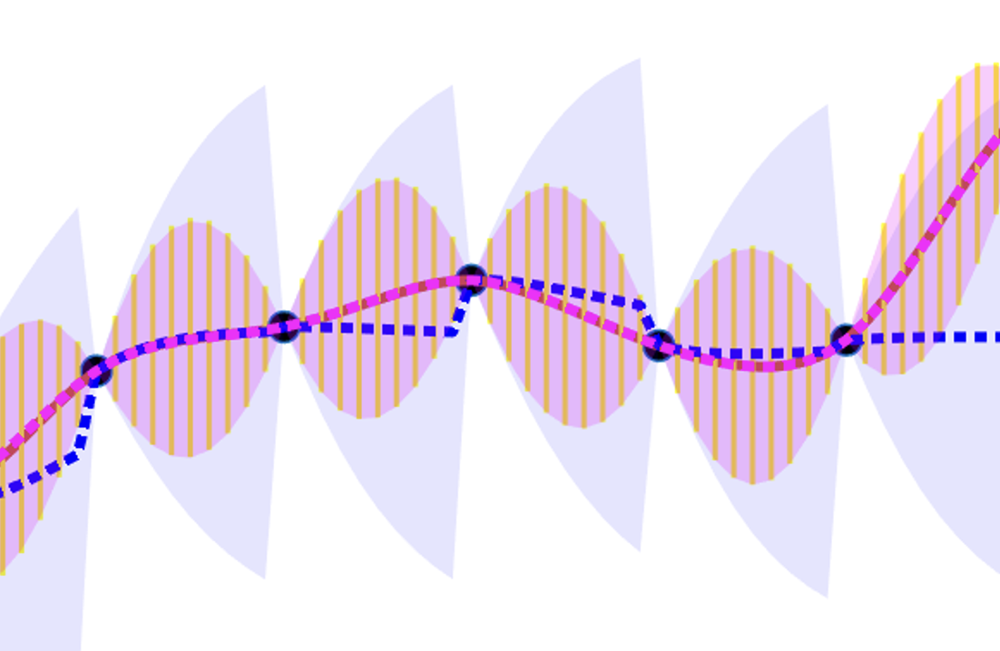

+++
title = 'Gaussian Process Regression via Kalman Filtering'
draft = true

[math]
enable = true
+++

| 

 | 

 | 

 |
| :-----------: | :-----------: | :-----------: |
| **Author:** Joanna Zou | **Date:** Feb. 12, 2022 | [Cite this page]() |

We show that a Bayesian filtering technique which probabilistically models unknown inputs of a dynamical system can be used to efficiently estimate critical states of in-situ structures, paving a way for improved structural health monitoring and performance-based design of offshore wind turbines.

\( x + y = z \)

$$
\begin{aligned}
2x + 3y &= 7 \\
x - y &= 1
\end{aligned}
$$

**References**  

[**J. Zou**, E. Lourens, A. Cicirello. "Virtual sensing of subsoil strain response in monopile-based offshore
wind turbines via Gaussian process latent force models." *Mechanical Systems & Signal Processing.* 200 (110488). 2023.](https://www.sciencedirect.com/science/article/abs/pii/S0888327023003965?via%3Dihub)
&nbsp;

[**J. Zou**, A. Cicirello, A. Iliopoulos, E. Lourens. "Gaussian process latent force models for virtual sensing in a monopile-based
offshore wind turbine." *Proceedings of the European Workshop on Structural Health Monitoring, pp. 290-29.* 2022.](https://link.springer.com/chapter/10.1007/978-3-031-07254-3_29)

