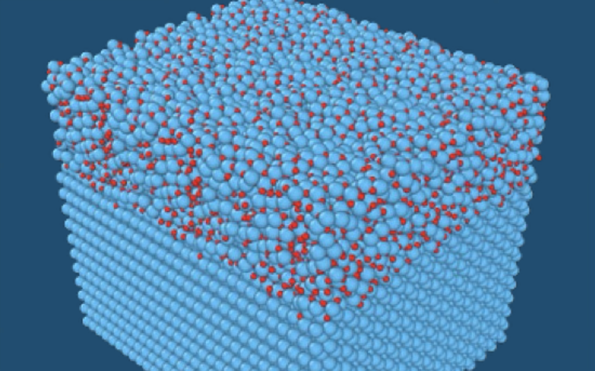

+++
title = 'Bayesian Methods for Atomistic Modeling of Materials'
+++

 Image credit: Dionysios Sema 

### Summary

The [Center for the Exascale Simulation of Materials in Extreme Environments (CESMIX)](https://cesmix.mit.edu/) seeks to advance multiscale materials simulation by connecting quantum and molecular simulations of materials with state-of-the-art programming languages, compiler technologies, and software performance engineering tools, underpinned by rigorous approaches to statistical inference and uncertainty quantification. The primary scientific objective of the center is to enable first-principles prediction of the degradation of complex, disordered, and multi-component materials under extreme loading, which is inaccessible to direct experimental observation. This application represents a technology domain of intense current interest, and exemplifies an important class of scientific problems — involving material interfaces in extreme environments.

Central to this vision is the use of Bayesian modeling for learning and calibration of atomistic models from quantum mechanical data. This probabilistic framework supports principled model selection, active learning, and uncertainty quantification of machine learning interatomic potentials. To support these goals, CESMIX has developed an open-source ecosystem of composable Julia packages for atomistic simulation. Core packages include *InteratomicPotentials.jl*, which provides a common interface for classical and data-driven interatomic potentials such as SNAP and the Atomic Cluster Expansion (ACE); *PotentialLearning.jl*, which implements Bayesian methods for inferring parameters of interatomic potential models from atomistic data; and *Atomistic.jl*, which provides a unified programming interface for molecular dynamics simulation programs such as LAMMPS and Molly. 

My primary contribution to the Julia codebase is in developing [*Cairn.jl*](https://github.com/cesmix-mit/Cairn.jl), a Julia library of active learning routines which adaptively generate data and refine machine learning interatomic potentials. *Cairn.jl* casts active learning into a composable workflow, defined by components such as the sampling algorithm, stopping criterion, data subset selection method, and training loss. The library enables the implementation of enhanced sampling algorithms such as uncertainty-driven dynamics (UDD) and Stein kernelized molecular dynamics (SKMD).

More information on the project can be found at [cesmix.mit.edu](https://cesmix.mit.edu/).

