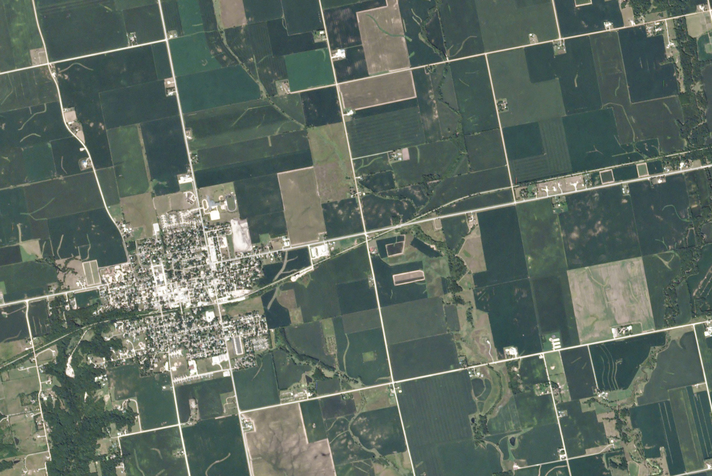

+++
title = 'Image Segmentation for Land Use Classification'
+++

 Image credit: Planet Labs 

### Summary

Information on crop distributions early in the growing season can help predict food shortages or surpluses, particularly in agricultural regions where ground-based crop data is sparse. We develop a neural network model which performs image segmentation of satellite imagery for the task of early season crop classification. Since models trained on spectral satellite imagery are hindered by cloud cover and atomistic variability, especially during early-season planting periods, we assess the efficacy of using exclusively **Sentinel-1 synthetic aperture radar (SAR) data**. We implement a **U-Net model** for the image segmentation task, where the contracting path extracts spatial context via convolution and pooling layers while the expansion path usamples and merges this context to produce full-size image predictions. The model is trained on 256x256 pixel patches, each with 3 image bands, of satellite imagery data obtained with Google Earth Engine, and model predictions across 12 classes of crop types are validated using labels from the USDA Cropland Data Layer.

 Diagram of the custom U-Net architecture for early season crop classification from satellite radar imagery. 

The baseline model is iteratively refined by testing multiple optimization algorithms, introducing learning rate decay, and implementing dropout regularization, which increased the model accuracy by 11%. We hypothesize that a U-Net architecture is more appropriate for the specific problem of early season crop classification compared to LSTM frameworks, given the limited extent of the available temporal signal, and found in our experiments that a convolutional LSTM model yielded comparable accuracy but at greater computational cost. This work constitutes a first study of the efficacy of using SAR data for land use classification, and as Sentinel-1 increases their data collection frequency, there will be further opportunities to develop land use classification models using a combination of both spectral and SAR image data. 

### Related Papers

W. T. Dado, R. Pan, **J. Zou** (equal contribution). "Early Crop Type Image Segmentation from Satellite
Radar Imagery." *Project report for Stanford CS230: Deep Learning*. 2020.
