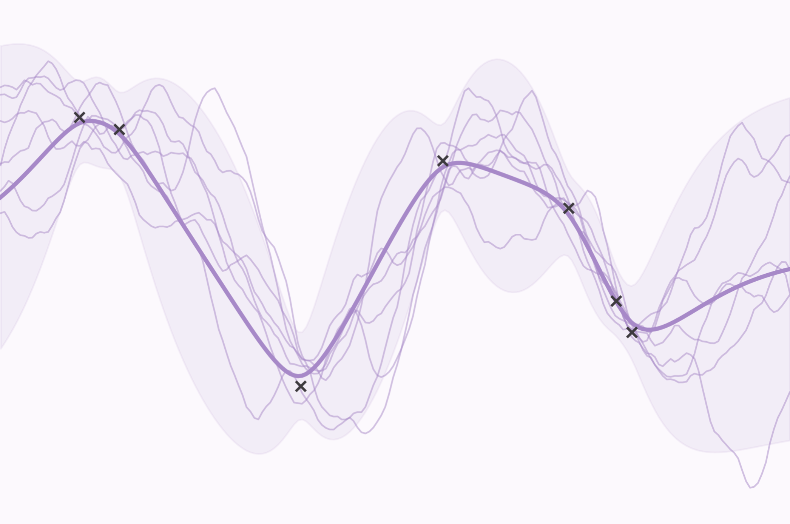
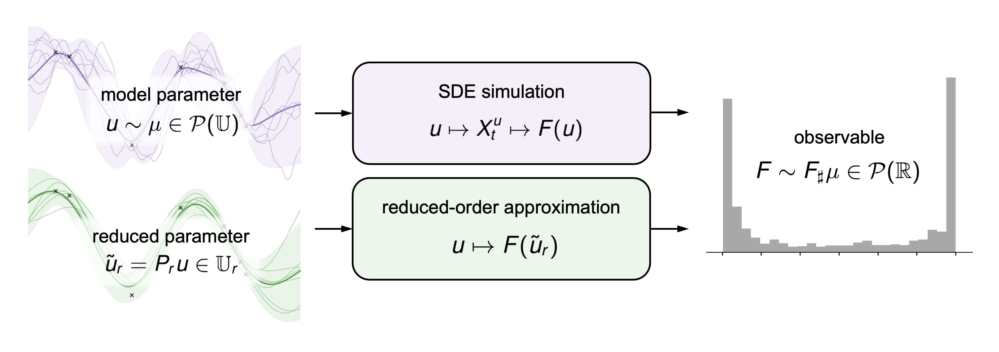

+++
title = 'Low-Rank Structure in Drift Functions of SDEs'
+++

### Summary

Data-driven models of stochastic differential equations (SDEs) are inherently uncertain as a result of the choice of finite training data. This uncertainty is generally represented by a distribution of parameters of drift function of the SDE, whether corresponding to a posterior distribution from Bayesian inference or an ensemble of models with varying parameters. In **forward uncertainty quantification**, we seek to characterize how uncertainty in the input drift function influences uncertainty in output observable quantities. This task amounts to solving for the **pushforward distribution** of the observables, which is typically not available in closed form and must be characterized by Monte Carlo simulation. The pushforward map is characterized by simulating the SDE with parameters sampled from the input distribution and calculating the observable functional of the solution of the SDE. 

Since forward uncertainty quantification by explicit simulation within Monte Carlo trials is computationally expensive, a common strategy to reduce the cost of each trial is to construct **surrogate operators** which efficiently approximate the pushforward map. However, such operators are challenging to learn when the input dimension is high-dimensional or infinite-dimensional. Therefore, sensitivity analysis and forward uncertainty quantification often employ dimension reduction techniques to reduce the dimension of the parameter space. One of the best known subspace-based approaches to dimension reduction is the **Karhunen-Loève expansion**, which derives a finite-dimensional subspace of a Hilbert space from the spectral decomposition of the covariance of the stochastic process corresponding to the infinite-dimensional parameter. However, this technique targets accuracy in terms of the reduced-dimensional approximation of the parameter, rather than in terms of output functionals of the parameter. 

 In low dimensions, surrogates of the parameter-to-observable map are more tractable to construct for performing forward UQ via Monte Carlo simulation. 

We use **derivative informed subspaces** of infinite-dimensional Hilbert spaces for improving the tractability of uncertainty quantification of path-space observables of SDEs. Derivative informed subspaces are a dimension reduction technique that identifies directions in the parameter space along which a function of interest has the greatest variation. In the infinite-dimensional setting, derivative informed subspaces corresponds to solving for a complete basis of the Hilbert space of drift pertubations which is adapted to an observable, such that we have certified bounds on the error in the reduced order approximation of the observable. The subspace depends on a choice of probability measure on drift perturbations; in this work, we consider Gaussian measures on Hilbert spaces, which are the most widely applied form of probability measure for stochastic processes. We show appropriate conditions on the drift perturbations and path-space observable for the derivative informed subspace to be well-defined in the SDE setting.

### Related Papers

**J. Zou**, H. C. Lie, Y. Marzouk. "Derivative-informed subspaces for dimension reduction on Hilbert spaces of drift functions of SDEs." *In preparation*.
