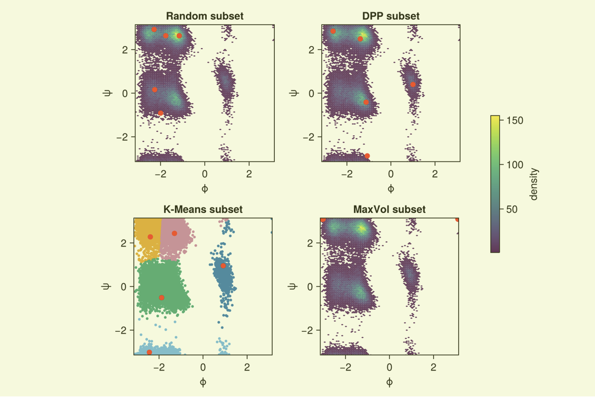
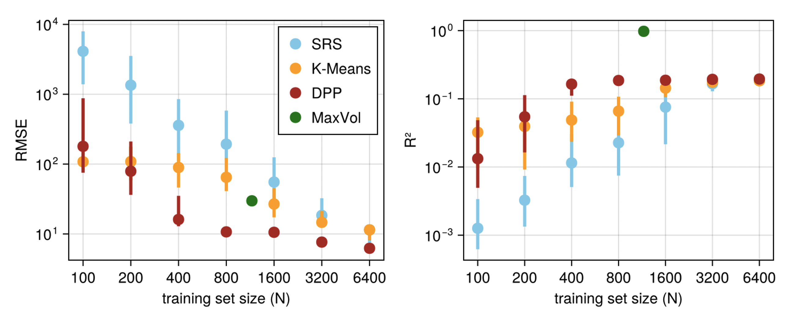

+++
title = 'Training Set Selection by Determinantal Point Processes'
+++

### Summary

Many modern advances in the atomistic simulation of chemical phenomena stem from the use of **machine learning interatomic potentials (MLIPs)**, data-driven surrogate models of atomistic force fields that enable molecular dynamics (MD) simulation at greater system sizes and time scales than what is feasible with *ab initio* methods. Due to the significant cost of quantum mechanical calculations, training datasets must be limited in size to keep the data generation task computatioanlly tractable and reduce overfitting to redundant data. However, these sets must also retain representation of conformational diversity in order to produce robust MLIPs capable of capturing chemical processes of interest.

We present a novel application of **determinantal point processes (DPPs)** to the task of selecting informative subsets of atomic configurations to label with reference energies and forces from costly quantum mechanical methods. A DPP is an efficient probabilistic model over subsets of discrete sets which assigns greater likelihood to subsets with diverse elements, as determined by a kernel matrix measuring the similarity between elements. If the kernel matrix is chosen to be the Fisher information matrix, then DPPs can be viewed as a principled probabilistic counterpart to the MaxVol algorithm, as both approaches rely on the D-optimality principle of maximizing the matrix determinant.

 Error in predicted potential energy of HfO systems by MLIPs trained with each data subset selection algorithm: simple random sampling (SRS), k-means clustering, DPPs, and MaxVol. 

Through experiments with hafnium oxide data, we show that DPPs constructed from kernels of molecular descriptors are competitive with existing approaches to constructing compact but diverse training sets, leading to improved accuracy and robustness in machine learning representations of molecular systems. Our work identifies promising directions to employ DPPs for unsupervised training data curation with heterogeneous or multimodal data, or in online active learning schemes for iterative data augmentation during molecular dynamics simulation.

### Related Papers

**J. Zou**, Y. Marzouk. "Data Curation for Machine Learning Interatomic Potentials by Determinantal Point Processes." *ICLR AI4MAT Workshop.* Singapore. 2025.

