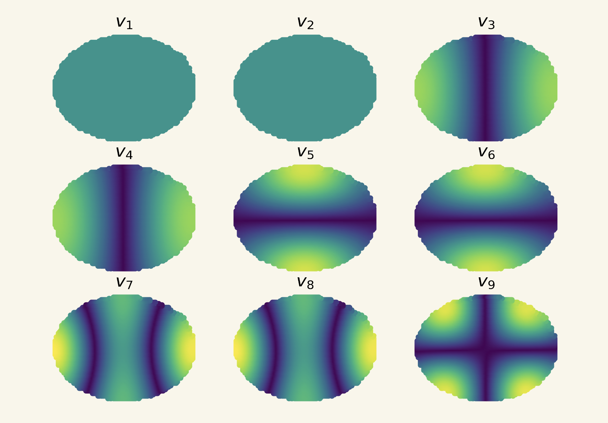
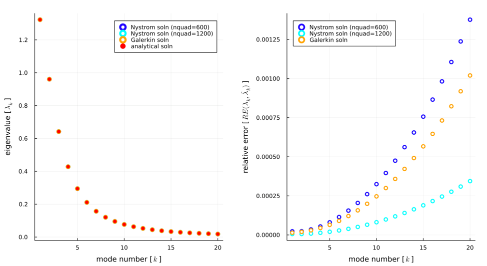
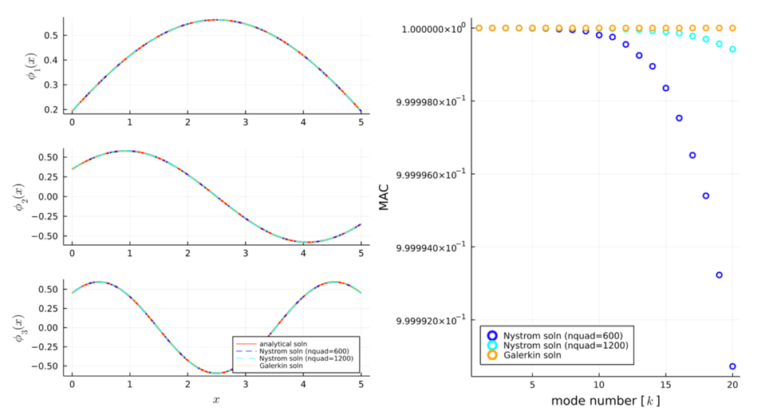

+++
title = 'Numerical Solutions to Fredholm Integral Eigenvalue Problems'
math = true
+++

### Summary 

**Random fields**, or functions which take random values at every point of a continuous domain, are used ubiquitously as models in science, engineering, and economics applications. To suit computational implementations, an infinite-dimensional random field must be represented by a finite number of random variables. The **Karhunen-Loève (K-L) expansion** is one such method of random field discretization in which a square integrable random field is represented as a series expansion based on the spectral decomposition of its covariance kernel function into corresponding eigenvalues and eigenvectors.

To develop a K-L expansion as a model approximation of a random field, the eigenbasis comprising the series expansion must be derived from the solution to a **Fredholm integral eigenvalue problem (IEVP)**. Analytical solutions to IEVPs are only feasible for a limited set of covariance kernel functions. As integral equations cannot be represented exactly numerically, the eigenbasis corresponding to kernels without such an analytical solution must be approximated using discretization schemes.

In general, algorithms for IEVPs may be categorized into three main classes: direct numerical integration schemes, projection schemes, and degenerate kernel methods. The **Nyström method** is the preeminent algorithm using direct numerical integration, whereas the **Galerkin method** is a commonly implemented projection-based approach (Betz 2014). Degenerate kernel methods avoid the need to compute the eigenbasis by approximating the covariance kernel with an alternative basis, with tradeoffs in accuracy and robustness; for this reason, degenerate kernel methods are not considered in this work. 

This project studies the **inverse problem** of fitting a K-L expansion model to a set of noisy data samples of a random field. This inverse problem is explored using a Bayesian inference approach in the works of Marzouk & Najm (2009) and Chowdhary & Najm (2016). In particular, a custom implementation of the Nyström method is developed and evaluated against the Galerkin method as a competing algorithm for solving the integral eigenvalue problem in the K-L expansion. The algorithms are compared in terms of computational efficiency, measured by operation counts, as well as in terms of accuracy, measured with respect to the analytical solution of the eigenvalues and eigenvectors of the exponential covariance kernel. The purpose of the comparison is to evaluate the suitability of each algorithm for implementation in solving inverse problems, where the IEVP solution is required for computing a maximum a posteriori (MAP) estimate of model parameters (the kernel hyperparameters and the series expansion coefficients) given a particular dataset. 

In this study, the Nyström and Galerkin methods of solving the IEVP are validated using a numerical example of a Gaussian random field with an exponential covariance kernel. The results show that for the same number of Gauss quadrature points used in numerical integration, the eigenvalues and eigenvectors computed by the Galerkin method achieve greater accuracy than those by the Nyström method, as the projection-based approach minimizes error in the eigenvectors across the whole domain of $x$. However, the discrepancy in accuracy of the Nyström method may be overcome by increasing the number of quadrature points while maintaining significantly lower computational expense. Therefore, Nyström methods are appropriate for straightforward covariance kernels (e. g. stationary or isotropic) or in applications where the need for fast computation is prioritized over approximation accuracy. On the other hand, Galerkin methods should be preferred for applications with complex covariance kernels or with high sensitivity to error in the approximation of the eigenbasis. There is a wide array of literature on the development of ``fast" algorithms for performing Galerkin projections, including the approximation of the covariance matrix as a hierarchical matrix (Khoromskij 2009, Allaix 2013), modification of the domain for numerical integration (Pranesh 2014), and isogeometric methods of discretization (Rahman 2018). Schwab et al. (2006) discuss a fast multipole methods approach which reduces the computation of the K-L expansion with stationary covariances to log linear complexity. 

 First 20 eigenvalues, computed using the Nystr\"om method with two levels of quadrature resolution (600 and 1200 quadrature points, respectively) and the Galerkin method with 600 quadrature points. 

 MAC values between the first 20 eigenvectors of the analytical solution and that of the numerical methods. 

In applications to parameter estimation for K-L expansions, the Nyström method is implemented to solve for the eigenbasis of the covariance kernel due to its relatively low computational demand. This efficiency is necessary for repeated calls to the IEVP solution to evaluate the forward operator, whether for objective function evaluations in a least square optimization routine or for samples of the parameters in a Bayesian MCMC sampling scheme. The choice of the Nyström method takes advantage of the fact that model uncertainty originating from error in the IEVP solution, as well as in the truncation order of the expansion, can be accommodated probabilistically in a Bayesian inference framework. In other words, the approximations made by the Nyström method are reasonable in the context of inverse problems, where the expansion coefficients are assumed to be random variables and the relative modal contributions may be tuned to limit the influence of error in the estimated higher order eigenvectors.

### Related Papers

**J. Zou**. "Numerical solutions to the Fredholm integral eigenvalue problem in Karhunen-Loeve expansions." *Project report for MIT 18.335: Numerical Methods*. 2022.
