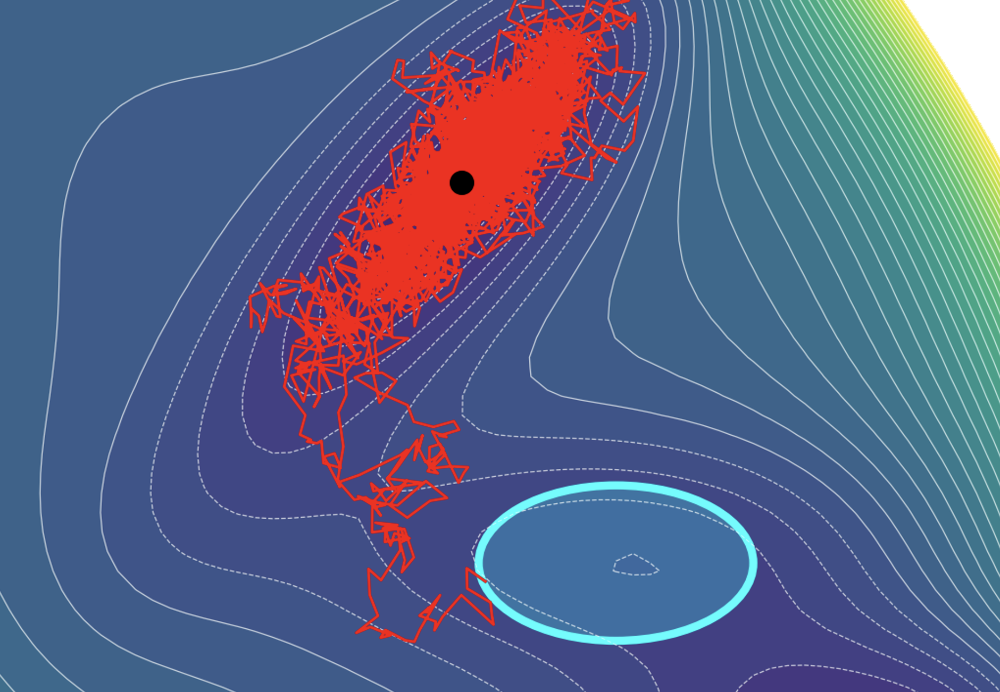
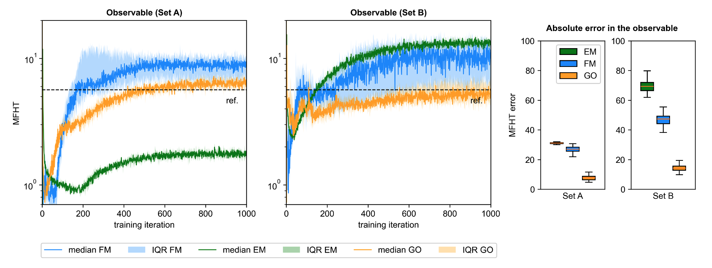

+++
title = 'Path-Space Approaches to Learning Stochastic Differential Equations'
+++

### Summary 

**Stochastic differential equations (SDEs)** are widely used to model stochastic dynamical systems in disciplines such as computational physics, chemistry, and biology, engineering and control systems, and mathematical finance. Due to their random nature, dynamical systems governed by SDEs are generally characterized by their probability laws rather than individual path realizations. A common goal is to quantify statistics of the path expressed as expectations with respect to the law of the solution of the SDE, referred to as **path-space observables**. These quantities relate to time-dependent properties of the system, such as transition probabilities, reaction rates, accumulated costs, or stability metrics, and are useful for downstream tasks in reliability analysis and system design.

Path-space observables are often computationally demanding to quantify, whether by solving a partial differential equation involving the generator of the SDE or using Monte Carlo methods involving multiple long-time path realizations. These costs are compounded for SDEs defined by high-fidelity first-principles models where the drift function is expensive to evaluate. Although **surrogate models** can substantially reduce the cost of simulation, their utility depends on their ability to reproduce the path-space observable of interest. Standard learning objectives for SDEs based on pointwise accuracy in the drift may not guarantee accuracy in path-space statistics under general conditions, or they require reference data of the observable itself, which are often noisy, inaccurate, or unavailable. 

We introduce a novel objective function for learning a data-driven surrogate model of the drift function of an SDE which preserves the accuracy of path-space observables relative to an expensive reference process. The learning objective is **goal-oriented** in the sense that it targets the fidelity of a specific path-space observable of the stochastic dynamics. Moreover, it is a **variational objective** in that it learns the drift function of the SDE from a parametric family of functions and relies only on data on the drift function of a reference high-fidelity SDE. The goal-oriented loss is derived from an **information inequality** which bounds the absolute error in the path-space observable. Treating this bound as a learning objective yields a proxy regression problem, where minimizers of the objective control error in the observable. Compared to similar goal-oriented approaches, our error bound applies symmetrically to a broader class of path-space observables while balancing accuracy -- i.e. tightness of the upper bound -- and computational simplicity to suit practical applications. In particular, we have a closed-form gradient of the goal-oriented loss, leveraging the Fréchet derivative of expected path functionals, which remains tractable for implementation in stochastic gradient descent schemes. Our numerical experiments show that in comparison to existing methods, our approach to goal-oriented learning can lead to models which reproduce first transition time statistics more accurately and are more robust to perturbations in the training data.

 Compared to energy-matching (EM) and force-matching (FM) losses, our goal-oriented (GO) loss leads to more accurate predictions of mean first hitting times (MFHT) across datasets. 

### Related Papers

**J. Zou**, H. C. Lie, Y. Marzouk. "Goal-oriented learning of stochastic differential equations using error bounds on path-space observables." *Preprint, submitted to SIAM Journal on Multiscale Modeling and Simulation.* 2026.

