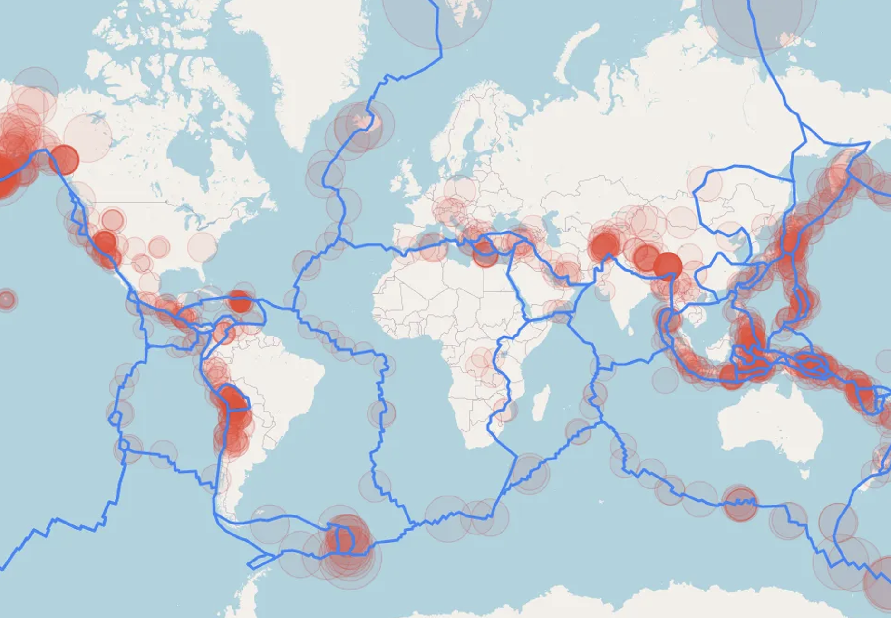

+++
title = 'High-Performance Computing for Probabilistic Hazard Analysis'
+++

 Image credit: Aaron Lee 

<!-- | 

 | 

 | 

 |
| :-----------: | :-----------: | :-----------: |
| **Author:** Joanna Zou | **Date:** Dec. 20, 2021 | [Cite this page]() | -->

<!-- We develop the most comprehensive natural hazards simulation software to-date, utilizing machine learning, high performance computing, and uncertainty quantification techniques to evaluate urban infrastructure risk to earthquake and tsunami disasters.   -->

### Summary

The [NHERI Computational Modeling and Simulation Center (SimCenter)](https://www.designsafe-ci.org/) is an NSF-sponsored project developing extensible scientific workflows for quantifying the effect of natural hazards on infrastructure, lifelines, and communities. The software suite enables large-scale simulation of natural hazards, including earthquake, hurricane, and storm surge events, and the resulting impact and damages to physical infrastructure. Monte Carlo realizations of natural hazard events are used to provide a probabilistic estimate of aggregate loss (expressed in quantities such as economic cost, operational downtime, and human casualties) which critically informs risk mitigation strategies in regional-level policy. 

In contrast to more general-purpose scientific workflow systems, SimCenter software tools have the added features of 1) access to high-performance computing resources on the cloud through the Texas Advanced Computing Center, to enable parallel workflows for large-scale simulation; 2) uncertainty quantification using Dakota, allowing users to quantify and propagate uncertainties; 3) streamlined integration with existing software applications and databases, such as OpenSees and the PEER Strong Ground Motion Database; and 4) a modular framework for workflow construction and extensions.

My contribution was primarily to building the connection between [R2D](https://github.com/NHERI-SimCenter/R2DTool) (Regional Resilience Determination) Tool, which provides probabilistic damage and loss estimates for regions subject to natural hazards, and [SimCenterBackendApplications](https://github.com/NHERI-SimCenter/SimCenterBackendApplications), the backend program unifying the workflow components.

More information on the project can be found at [simcenter.designsafe-ci.org](https://simcenter.designsafe-ci.org/).