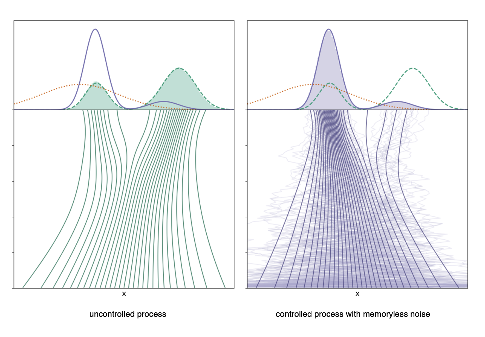

+++
title = 'Controlled Generative Diffusions for Rare Event Simulation'
math = true
+++

 Image adapted from Domingo-Enrich et al, "Adjoint matching: fine-tuning flow and diffusion generative models with memoryless stochastic optimal control" (2025).  

### Summary 

We propose adapting a controlled generative diffusion model for applications in rare event simulation. Building on Domingo-Enrich et al. (2025), we detail our theoretical formulation for solving for the optimal control via adjoint matching. We demonstrate results using our formulation toward challenges in rare event simulation: first, we incorporate subset simulation of sequentially estimating intermediate event probabilities to drive samples toward the failure threshold. Then, we introduce importance sampling to minimize the computational cost of many evaluations of the gradient of the reward function. Below, we summarize the problem statement and relevant techniques.

### Intro

In many generative modeling applications, **fine-tuning** methods have been used to improve the sample quality of diffusion models based on a specified reward function. For a base generative model which samples a distribution $p_{\text{base}}(x)$, one can generate samples from a tilted target distribution $p(x)$ based on an appropriate reweighting by the reward function $r(x)$, e.g., 

$$p(x) \propto p_{\text{base}}(x)\exp(r(x)).$$

This perspective has close ties to Bayesian inference, where $r(x)$ encodes a log likelihood function, and has been used to align the output of generative models with human preferences using human feedback data, such as with large language models (Ziegler et al, 2019) and image generators (Domingo-Enrich et al, 2025).

### Controlled generative diffusions

Let $X_t \in \mathbb{R}^n$ denote the state of a generative diffusion process at diffusion time $t \in [0,T]$. The baseline generative diffusion is a **reverse-time stochastic differential equation** (SDE) written schematically as

$$dX_t = b_0(t,X_t) dt + \sigma(t) dW_t, \quad X_0 \sim N(0,\mathbb{I}_n)$$

where $b_0: [0,T] \times \mathbb{R}^n \to \mathbb{R}^n$ denotes the base drift,  $\sigma: [0,T] \to \mathbb{R}^{n \times m}$ denotes the diffusion coefficient, and $W_t$ denotes $m$-dimensional standard Brownian motion. In the reverse-time SDE, the base drift incorporates the score of the time-marginal distribution $p_0(t,x)$, such that the law of the state at the terminal time, $X_T$, corresponds to $p_{\text{base}}$. One can interpret the SDE as transporting samples from a tractable reference distribution, such as a standard Gaussian, to the base distribution $p_{\text{base}}$. 

Suppose we define a reward function, $r: \mathbb{R}^n \to \mathbb{R}$, which assigns high values to desired terminal samples. Given a controlled process

$$dX^u_t = [ b_0(t,X^u_t) + \sigma(t) u(t,X^u_t)] dt + \sigma(t) dW_t', \quad X^u_0 \sim N(0,\mathbb{I}_n)$$

the fine-tuning problem corresponds to solving for the control function $u^*:[0,T] \times \mathbb{R}^n \to \mathbb{R}^n$ for which the law of $X^{u^*}_T$ is the tilted distribution $p$ weighted by the reward. 

### Fine-tuning via stochastic optimal control

**Stochastic optimal control (SOC)** defines the appropriate objective to solve for the optimal control function. A common instantiation is the quadratic cost control-affine problem formulation,
    
$$u^* = \underset{u \in \mathcal{U}}{\text{argmin}} \  \mathbb{E}_{X^u \sim \mathbb{P}^u} \left[ \int_0^T \left(\frac{1}{2} ||u(t, X_t^u)||^2 + f(t,X_t^u)\right) \,dt + g(X_T^u) \right]$$

where $\mathbb{P}^u$ is the law of $X^u$, e.g. a path measure, $f$ are the running costs, $g$ is the terminal cost, and $\mathcal{U}$ is a suitable choice of Hilbert space of control functions. We define the cost functional as the expected future cost starting from a state $x$ at time $t$,

$$J(u;t,x) \coloneqq \mathbb{E}_{X^u \sim \mathbb{P}^u} \left[ \int_t^T \left(\frac{1}{2} ||u(s,X_s)||^2 + f(s,X_s)\right)\,ds + g(X_T) | X_t = x \right].$$

The value function is the optimal value of the cost functional $J(u^*;t,x)$ and can be expressed in terms of the law of the uncontrolled base process, $\mathbb{P}^0$, as

$$V(t,x) = -\log \mathbb{E}_{X \sim \mathbb{P}^0} \left[ \exp\left( -\int_t^T f(s,X_s) \,ds - g(X_T) \right) | X_t = x \right].$$

Setting $f=0$ and $g=-r$, we can arrive at an expression for the distribution $p^*$ induced by the optimal control $u^*$ as

$$p^*(X_0,X_T) = p_{\text{base}}(X_0,X_T) \exp(r(X_T) + V(0,X_0)).$$

Note that the above distribution is not equal to the target tilted distribution due to the dependency on the initial value function, $V(0,X_0)$. One could try to formulate different costs $f$ and $g$ to correct for this bias, though it may be analytically or computationally difficult. Instead, it can be shown that it is possible to remove the value function bias by choosing a particular **memoryless noise schedule** during the fine-tuning procedure. A generative process is *memoryless* if $X_0$ and $X_T$ are independent, such that $p_{\text{base}}(X_0,X_T) = p_{\text{base}}(X_0)p_{\text{base}}(X_T)$. This implies one can marginalize out the variable $X_0$ to obtain 

$$p^*(X_1) = \int p_{\text{base}}(X_0) p_{\text{base}}(X_1) \exp(r(X_1) + V(X_0,0))\,dX_0 \propto p_{\text{base}}(X_1) \exp(r(X_1)).$$

Therefore, solving the SOC problem with a memoryless base model will result in a fine-tuned model that generates samples according to the tilted distribution. A generative process is memoryless if the diffusion coefficient is chosen as

$$\sigma(t) = \sqrt{2 \eta_t},$$

where $\eta_t = \beta_t(\frac{\dot{\alpha}_t}{\alpha_t} \beta_t - \dot{\beta}_t)$, $\alpha_t=t$, and $\beta_t = 1-t$. A key contribution of Domingo et al. (2025) is **adjoint matching**, an efficient method of solving the SOC problem using a memoryless noise schedule without expensive reinforcement learning techniques. 

### Rare event estimation 

One practical application of sampling from a tilted distribution is **rare event estimation**, where the objective is to estimate the probability of events that are extremely unlikely under the target distribution. For an event domain $A$, the probability is given by $\mathbb{P}[x \in A] = \mathbb{E}_{x \sim p_\text{base}}[\mathbb{1}_A(x)]$. In literature, the boundary of the failure domain $\partial A$ is referred to as the *failure threshold*. In this setting, standard Monte Carlo estimators are computationally inefficient due to the prohibitively large number of samples from $p_\text{base}$ which would be required to observe the rare event and estimate its statistics. **Importance sampling** addresses this challenge by biasing the sampling toward rare-event regions and then correcting the bias with appropriate weights. Exponential tilting is common in importance sampling; unfortunately, it is usually confined to regimes where both $p_\text{base}$ and $r$ come from well-understood parametric exponential families.

In the context of rare event estimation, solving for an optimal proposal distribution $q$, e.g. by cross-entropy methods, is increasingly more challenging when the probability of the rare event becomes extremely small. Au and Beck (2001) introduced **subset simulation** as a computationally tractable technique in this setting, which decomposes a rare event into a sequence of more frequent intermediate events. This is achieved by expressing the rare event probability, $P(A)$, as a product of conditional probabilities corresponding to $m$ nested intermediate events which satisfy $A_m \subset A_{m-1} \subset \cdots \subset A_1$, with $A_m = A$: 

$$P(A) = P(A_m) = P(A_1) \cdot P(A_2 | A_1) \cdot ... \cdot P(A_m | A_{m-1}).$$

The failure threshold $b_i$ corresponding to each intermediate event $A_i$ for $i=1,..,m$ is defined in terms of a performance function $Y=h(x)$, such that $A_i = \{ X : Y > b_i \}$. The thresholds are chosen adaptively such that the conditional probabilities $P(A_i | A_{i-1})$ are neither too small or too large to ensure efficient sampling. Subset simulation then samples from the conditional distribution corresponding to each probability, allowing the method to focus computational effort on progressively rarer regions of the input space. This sequential framework greatly improves the efficiency and robustness of rare event estimation, particularly in high-dimensional and nonlinear systems.

### Related Papers

D. Sharp, E. Williams, **J. Zou** (equal contribution). "Controlled Generative Diffusion Models for Rare-Event Simulation." *Project report for MIT 6.S982: Diffusion Models: From Theory to Practice*. 2025.

Paper distributed by request.