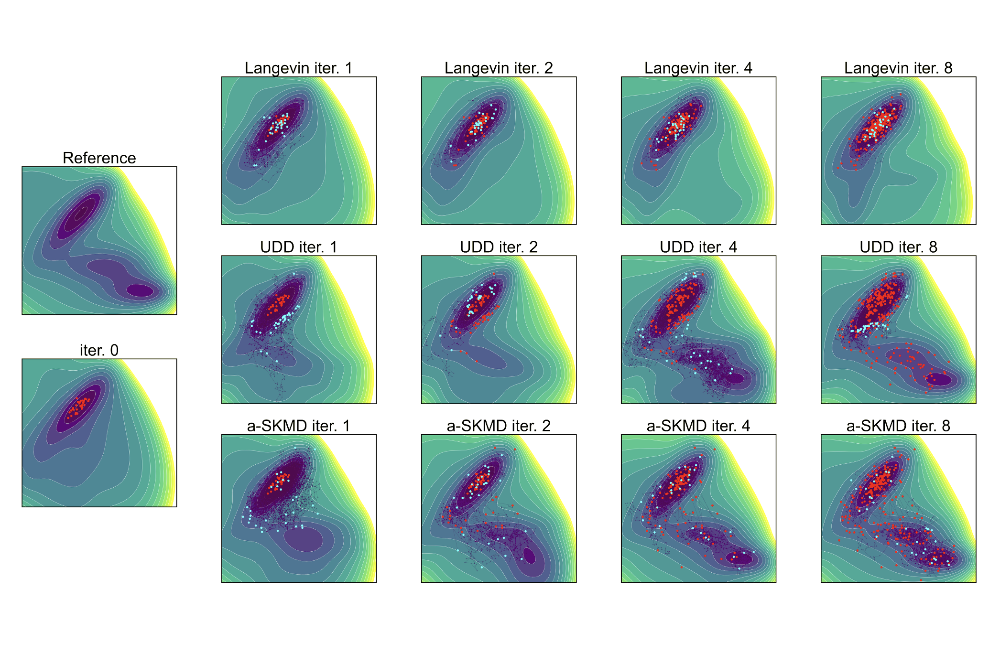
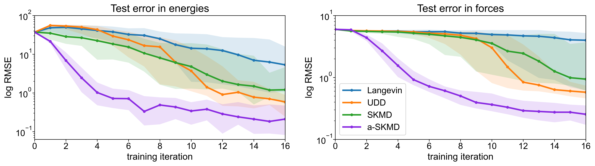

+++
title = 'Stein Kernelized Dynamics for Active Learning'
math = true
+++

### Summary

**Energy-based models (EBMs)** are a class of machine learning models that represent a probability distribution $\pi$ with a model of the corresponding *energy function* of the data, $E(x)$. In an EBM, the probability distribution is assumed to take the form of a Gibbs-Boltzmann distribution, $$\pi(x) \propto \exp(-E(x)).$$ EBMs have been used extensively to learn probability distributions in the context of generative modeling, reinforcement learning, and natural language processing; a physical example of an EBM is the interatomic potential function of a molecular system, which assigns a potential energy to each atomic configuration in proportion to their likelihood under the invariant distribution of the system at thermal equilibrium. 

The accuracy of EBMs depends critically on the quality of the training data: training configurations must be representative of both key low-energy states and high-energy barriers separating them. Often times, the task of labeling data with reference calculations comes at a high cost, which limits the number of samples that can be feasibly added to the training set. Offline approaches to active learning select subsets of informative data to label, but often involve a challenging global optimization problem or expensive matrix determinant calculation to solve for an optimal subset. Therefore, we propose an efficient online approach to the active learning of EBMs using **Stein kernelized dynamics**, where candidate samples are collected in a greedy approach over the course of simulating an interacting particle sampler. The sampling algorithm is derived from **Stein variational gradient descent (SVGD)**, a particle-based variational inference algorithm in which the dynamics of an interacting particle set corresponds to a gradient flow on the space of probability measures. Our method is an asychronously updated stochastic version of SVGD which preserves the Gibbs-Boltzmann distribution as the asymptotic distribution of the dynamics. To orient the method for active learning, we combine this sampler with with an adaptive selection criterion inspired by **kernel herding** techniques for coreset selection. Our experiments suggest that our method achieves higher model accuracy in fewer training iterations compared to query-by-committee approaches to active learning. 

 SKMD with adaptive stopping (a-SKMD) leads to lower error and variance in predictions in fewer active learning iterations compared to Langevin-based sampling or uncertainty-driven dynamics (UDD). 

### Related Papers

**J. Zou**, F. Birks, D. Foster, Y. Marzouk. "Stein Kernelized Molecular Dynamics for Active Learning of Interatomic Potentials." *Preprint, submitted to NeurIPS.* 2026.

