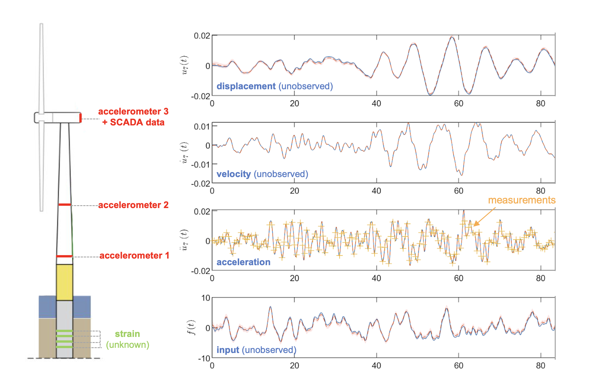

+++
title = 'Bayesian Filtering for Digital Twins'
+++

 Image credit: Kim Hansen 

<!-- | 

 | 

 | 

 |
| :-----------: | :-----------: | :-----------: |
| **Author:** Joanna Zou | **Date:** Feb. 12, 2022 | [Cite this page]() | -->

<!-- We show that a Bayesian filtering technique which probabilistically models unknown inputs of a dynamical system can be used to efficiently estimate critical states of in-situ structures, paving a way for improved structural health monitoring and performance-based design of offshore wind turbines. -->

### Summary

**Digital twins** are virtual representations of physical systems that allow us to monitor, predict, and control their behavior in real time. **Bayesian filtering** provides a principled framework for combining a prior model of the system dynamics with noisy, indirect observations to produce a probabilistic estimate of the system state, enabling the twin to continuously synchronize with incoming data, correct for model drift, and quantify uncertainty over time. The framework of the Kalman filter and its variants is naturally suited to **virtual sensing**, where in the absence of physical sensors at certain locations of the system, the state at the unobserved locations are extrapolated using a hybrid model combining a physics-driven model of the system with a data-driven model of latent quantities. 

Offshore wind turbines must be designed for efficiency and resiliency in order to meet growing global demand for renewable energy. Monopile-based support structures for offshore wind turbines are highly susceptible to cyclic fatigue damage, due to their widely varying environmental loading conditions over time as well as potential resonance effects. Monitoring fatigue-induced strains is generally infeasible, since sensors placed at critical regions of the monopile are often damaged in the process of monopile installation and are difficult to maintain. While external loads acting on the structure dictates their response, previous models for virtual sensing would either neglect unknown inputs or treat them as white noise in the dynamics, leading to suboptimal state estimates.

In this work, we propose using a **Gaussian process latent force model (GPFLM)** for virtual sensing of the progression of fatigue damage in support structures for offshore wind turbines. In the GPLFM, we cast both unknown sources of excitation (the "input") and unknown strains of the structure (the "state") into a joint Gaussian process model and use Kalman filtering and smoothing as an efficient sequential algorithm to perform Gaussian process regression. Unlike other virtual sensing algorithms, the GPLFM provides an explicit time-varying statistical model of the unknown forces and unaccounted noise which are learned from data. Moreover, this statistical model is a non-parametric representation of latent states, such that the problem of learning covariance relationships between states reduces to the inference of parameters of the GP covariance kernel. 

 Diagram of the wind turbine sensor channels (left). Displacement, velocity, and input time history inferred from acceleration measurements with the GPLFM (right). 

Our work is one of the first studies of the performance of the GPLFM for virtual sensing using in-situ vibration data from an operating structure. Using acceleration data collected from an offshore wind turbine in the Netherlands, we demonstrate that the GPLFM leads to accurate reconstruction of strain time histories in varying operational states with as few as two sensor channels at accessible locations of the structure. Moreover, we find that when model error is explicitly introduced, the error is accommodated by the use of a probabilistic model of the unknown inputs without sacrificing the performance of strain estimation. Our studies indicate that the use of the GPLFM for virtual sensing leads to greater estimation accuracy, robustness to error, and instrumentation efficiency than comparable non-probabilistic approaches. 

### Related Papers

**J. Zou**, E. Lourens, A. Cicirello. "Virtual sensing of subsoil strain response in monopile-based offshore
wind turbines via Gaussian process latent force models." *Mechanical Systems & Signal Processing.* 200 (110488). 2023.




**J. Zou**, A. Cicirello, A. Iliopoulos, E. Lourens. "Gaussian process latent force models for virtual sensing in a monopile-based offshore wind turbine." *Proceedings of the European Workshop on Structural Health Monitoring.* Lecture Notes in Civil Engineering, vol 253. Springer, Cham. 2022.

